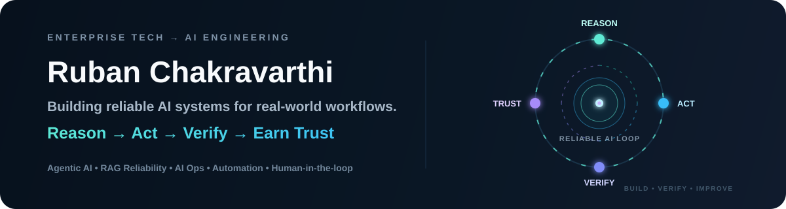

<p align="center">
  
</p>

<p align="center">
  <strong>AI Developer in Transition • Agentic AI • Automation • Enterprise Technology Background</strong><br/>
  <sub>Chennai, India • Generative AI certified • Building hands-on AI systems in public</sub>
</p>

<p align="center">
  <a href="https://www.linkedin.com/in/ruban-b-691642b9/">
    
  </a>
</p>

---

## The short version

I come from an **enterprise technology sales background across SAP, ERP, infrastructure and digital transformation**.

Over time, I became less interested in only selling technology — and more interested in **how intelligent systems are actually designed, automated, tested and trusted in the real world**.

That shift led me into **Generative AI and Agentic AI**.

I’ve completed a Generative AI certification and am continuing structured Agentic AI learning while building hands-on projects around **AI agents, automation, APIs, human approval, safety controls, verification and production-oriented backend engineering**.

> **My goal:** combine enterprise business understanding with practical AI engineering so I can build systems that solve real operational problems — not just demos.

---

## 🔥 Public proof projects

### 1. [Agent Control Plane](https://github.com/rubanchakravarthib308-spec/agent-control-plane)

**A production-minded execution layer for AI agents — plan, act, verify, approve.**

```text
Goal → Plan → Risk Gate → Human Approval → Tool Execution → Verification → Audit Trail
```

It demonstrates guarded tool execution, risk-aware approval, post-action verification, auditability, tests and CI.

➡️ **[Explore Agent Control Plane](https://github.com/rubanchakravarthib308-spec/agent-control-plane)**

### 2. [RAG Reliability Lab](https://github.com/rubanchakravarthib308-spec/rag-reliability-lab)

**A transparent lab for testing whether RAG answers are actually grounded in retrieved evidence.**

```text
Question → Retrieval → Answer → Citation Validation → Groundedness Score → Hallucination Risk → Reliability Gate
```

The first version includes deterministic retrieval, explicit evidence/citation types, citation validation, groundedness scoring, hallucination-risk scoring, automated tests, CI and architecture documentation — all runnable without paid APIs or hidden model behavior.

**Why I built it:** a RAG system should not be trusted just because it produces a fluent answer. It should provide evidence, validate citations and expose when support is weak.

➡️ **[Explore RAG Reliability Lab](https://github.com/rubanchakravarthib308-spec/rag-reliability-lab)**

### 3. [AI Ops Copilot](https://github.com/rubanchakravarthib308-spec/ai-ops-copilot)

**A production-minded incident triage copilot with runbook retrieval, risk gates, human approval and audit evidence.**

```text
Incident → Classify → Assess Severity → Retrieve Runbook → Recommend Action → Risk Gate → Human Approval → Audit Trail
```

The first version includes deterministic incident classification, controlled runbook retrieval, risk-aware recommendations, human approval for high-risk cases, explicit blocked/completed states, ordered audit events, automated tests, CI, architecture docs and an end-to-end demo.

**Why I built it:** AI in operations should assist judgment without silently becoming the authority. Recommendations need evidence, policy boundaries, review points and traceability.

➡️ **[Explore AI Ops Copilot](https://github.com/rubanchakravarthib308-spec/ai-ops-copilot)**

---

## What I bring from my previous career

<table>
<tr>
<td width="50%" valign="top">

### 🧭 Enterprise context
Years around enterprise technology taught me how real organizations think about systems, buyers, risk, integration, adoption and business outcomes.

### 🤝 User & stakeholder empathy
A strong system is not only technically impressive. It has to solve a problem somebody actually cares about and can trust enough to use.

</td>
<td width="50%" valign="top">

### ⚙️ Builder mindset
I’m now translating that enterprise perspective into architecture, APIs, persistence, testing, automation and working AI systems.

### 🛡️ Safety by design
For systems that can take real actions, I care about authorization, approval, replay protection, dry-run modes and independent verification.

</td>
</tr>
</table>

---

## 🚀 Flagship build — AI Social Intelligence & Action System

My main private project is an actively developed **AI social intelligence and recommendation platform**.

It explores what happens when an AI system has to connect to real platforms, understand content, evaluate trends, recommend changes, pass safety checks, wait for human approval where required, execute through APIs, and verify the final result.

```text
Social Platform APIs
        ↓
Content + Analytics Ingestion
        ↓
Trend Intelligence
        ↓
AI Recommendation Engine
        ↓
Policy / Safety Layer
        ↓
Human Approval when required
        ↓
Controlled Execution
        ↓
Independent Read-back Verification
        ↓
Outcome Measurement
```

**Engineering themes:** OAuth 2.0 / PKCE • platform adapters • PostgreSQL • Redis • TypeScript • Fastify • Docker • policy enforcement • human-in-the-loop workflows • transactional execution • verification • automated testing

The production repository remains private while it is under active development.

---

## 📚 Learning + building path

- Completed **Generative AI certification through UpGrad**
- Continuing structured **Agentic AI learning through an institution**
- Building public projects to prove engineering capability through code, tests, architecture and CI
- Deepening Python, TypeScript, APIs, databases and production AI patterns alongside agentic systems

I’m deliberately avoiding the “certificate-only” path. The goal is to pair formal learning with **visible engineering proof**.

---

## 🔬 Problems I’m focused on

- **Agentic AI:** systems that can plan, call tools, maintain state and complete multi-step work
- **LLM reliability:** structured outputs, validation, retries, evaluation, guardrails and failure handling
- **Automation:** connecting AI to APIs and real business workflows
- **Human-in-the-loop systems:** deciding exactly when AI should stop and ask a person
- **AI product engineering:** moving from interesting prototype to something a team can actually operate
- **Verification:** knowing what the agent decided, what it changed and whether the change really happened

---

## 🧰 Engineering toolbox I’m building with

| Layer | Tools / Concepts |
|---|---|
| **Languages** | Python • TypeScript • JavaScript • SQL |
| **AI Engineering** | LLMs • AI Agents • RAG • Tool Calling • Structured Outputs • Prompt Engineering |
| **Backend** | Node.js • Fastify • REST APIs • OAuth 2.0 • PKCE |
| **Data** | PostgreSQL • Redis • Drizzle ORM |
| **Infrastructure** | Docker • Git • GitHub • CI/CD |
| **Quality** | TypeScript checks • automated tests • policy gates • dry-run execution • read-back verification |

---

## 🤝 Where I’m heading

I’m working toward AI engineering roles and projects where my combination of **enterprise technology experience + hands-on Agentic AI engineering** is useful.

I’m especially interested in:

**AI agents** • **enterprise automation** • **LLM applications** • **workflow orchestration** • **AI product engineering** • **business systems enhanced by AI**

If you’re interested in the transition story, my broader professional background, or a possible collaboration, [connect with me on LinkedIn](https://www.linkedin.com/in/ruban-b-691642b9/).

<p align="center">
  <strong>Learning deeply. Building publicly. Earning credibility through working systems.</strong>
</p>
